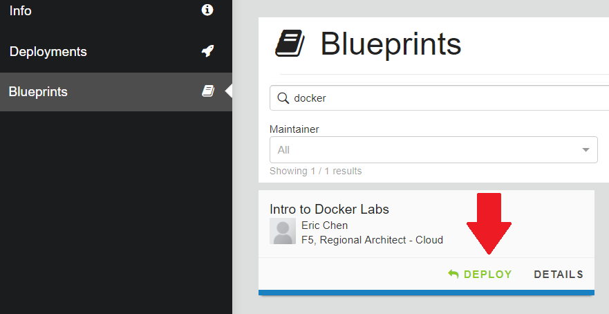
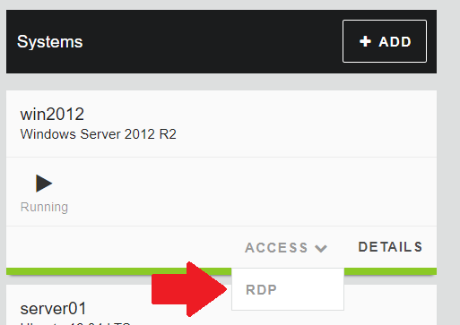

Connecting to UDF
=================

We consider that you have access to UDF for the different labs

Start your environment
----------------------

If you are running this on your own, find the 'Introduction to Docker' blueprint and deploy it.

Access your environment
-----------------------

Once your environment is started, find the 'win2012' component under 'Components' and launch RDP (in the ACCESS menu)

Click on the shortcut that got downloaded and it should open your RDP session. The credentials to use are under the Details tab.

.. warning:: For MAC user, it is recommended to use Microsoft Remote Desktop. You may not be able to access your jumpbox otherwise. It is available in the App store (FREE).
   

